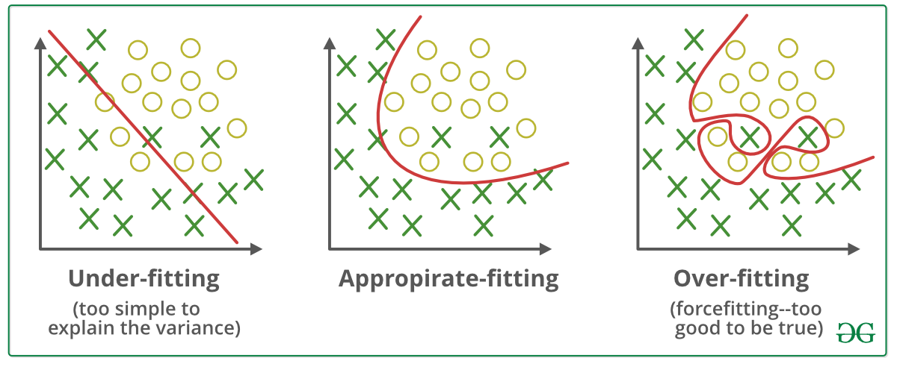
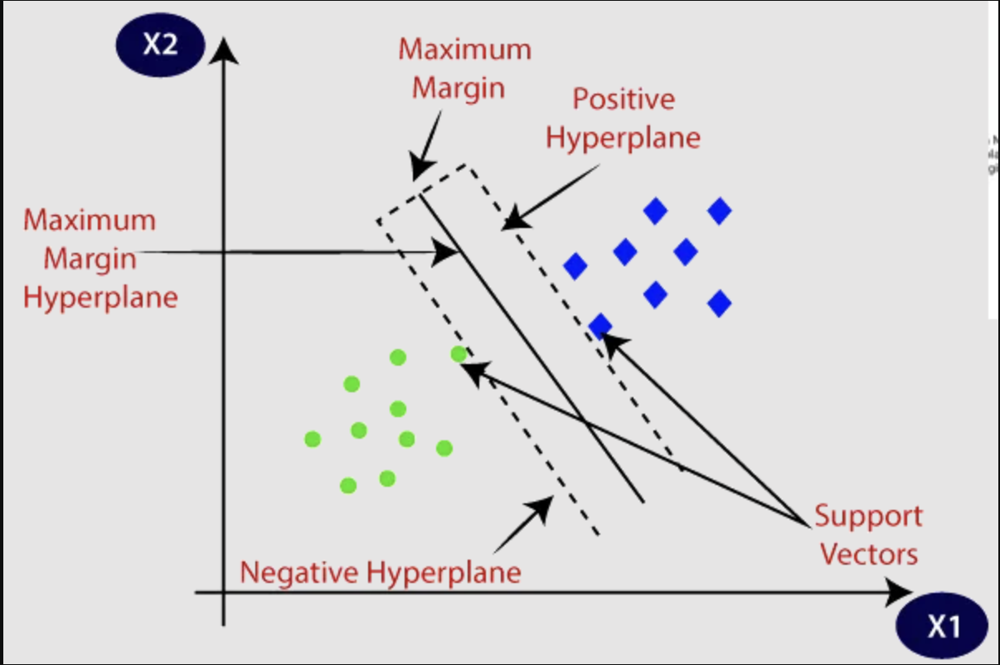

# GDSC - ML Study Jams 2024
This repository contains note and references of Google Developer Student Club - ML Study Jams 2024 conducted at Charusat University, Anand, India on 12th and 13th March 2024

`Notion Notes` --> [Link](https://standing-aftershave-2a9.notion.site/GDSC-ML-Study-Jams-36010f5aa94342f5a37d6aa1b26d6f44?pvs=4)


# Introduction to AI, ML and DL

### What is AI?

**AI** stands for **Artificial Intelligence**. **Artificial Intelligence** is a branch of study which focuses on understanding and developing Machines which think, learn and act like human. These type of machines can help solve problems, learn and explain information, analyze a situation and draw conclusion to it.

### What is ML?

**ML** stands for **Machine Learning**. **Machine Learning** are the model and algorithms which help a machine learn new things. ML algorithms are algorithms which are used to train a model for future use.

### What is DL?

**DL** stands for **Deep Learning**. **Deep Learning** is a subfield of ML which uses neutral networks to make a machine understand and process like human brain.


# Type of ML models

- Based on the training and test data set there are ML models get divided into 3 categories
    - Overfitting → Training Data set **too big**, Test Data set **too small**.
    - Underfitting → Training Data set **too small**, Test Data set **too big**.
    - Optimal → Training Data set **normal**, Test Data set **normal**.

### Overfitting

- Model with too high accuracy and hard approach are called overfitting algorithms.
- These algorithms try to cover all the possibility.
- This type of model has low bais and high or very high variance.
- The behaviour of the overfitting model can be represented by the following graph.


### Underfitting

- Underfitting models have very low accuracy.
- This type of model doesn’t capture the underlying trend of the data.
- This type of model has high or very high bais and low variance.
- The behaviour of the underfitting model can be represented by the following graph.


### Optimal

- Optimised ML model is the most appropriate model for normal use as it as appropriate bais and appropriate variance.
- This model tries to generize the result.
- The behaviour of optimised model can be understood by following graph.


### Summary

- The behaviour of all three types of model is represented here.



# Algorithms

Classification ⇒ It clearly defines the state of result (between 0 to 1)

Regression ⇒ It predicts the state of result (0 or 1)

## Linear Regression ⇒ Regression

- Behaviour → Straight line progress
- Loss Function → Reviews the model and give a detailed feedback to the model
- Equation → y = mx+c
    
    y ⇒ output of model
    
    m ⇒ slope
    
- Error = Loss function - y

## Logistic Regression ⇒ Classification

- Behaviour → Non-linear regression (Can be wavy line progression)
- Activation function → This function is used to convert the result of the model in the range of 0 and 1.


## Support Vector

- Behaviour → Non-linear (Can be of any shape (circle, square, etc.))
- Support vector maximize the distance between the 2 or more rival groups by adding neutral group between them.
- Example → We have to arrange seating arrangement of 2 rival polical parties in an events, then we will make a party sit on extreme corner, the other party on the other corner and people not beloning to any party will be seated between them.



# Behind the Scenes

Now as soon as we give a prompt to a ML model it does 3 things

- NLU → Natural Language Understanding
- NLP → Natural Language Processing
- NLG → Natural Language Generation

## Basics of NLP

## Tokenisation

- This step divides prompt into tokens
- Tokenization can be divided into 2 steps -
    
    ### Sentence Tokenization
    
    Divide prompt into smaller sentence
    
    ### Word Tokenization
    
    Divide sentence token into word token
    

```python
!pip install nltk # '!' is used to install nltk in the working environment.
import nltk # Natural Language Tokenization Keras.
# nltk.download('punkt') # Uncomment this line in case of error.
from nltk.tokenize import word_tokenize # Used for Word Tokenization.
from nltk.tokenize import sent_tokenize # Used for Sentence Tokenization.
prompt = "Hi everyone, I am Harsh from CSPIT IT 4th semester. I had attended a super awesome GDSC event. Name of the event was GDSC ML Study Jams." # Assigned a string to 'prompt' variable.'
TokenizedSentence = sent_tokenize(prompt) # 'sent_tokenize' function will tokenize the prompt into sentence tokens.
print(TokenizedSentence) # Output -> ['Hi everyone, I am Harsh from CSPIT IT 4th semester.', 'I had attended a super awesome GDSC event.', 'Name of the event was GDSC ML Study Jams.']
TokenizedWord = word_tokenize(prompt) # 'word_tokenize' function will tokenize the prompt into word tokens.
print(TokenizeWord) # Output -> ['Hi', 'everyone', ',', 'I', 'am', 'Harsh', 'from', 'CSPIT', 'IT', '4th', 'semester', '.', 'I', 'had', 'attended', 'a', 'super', 'awesome', 'GDSC', 'event', '.', 'Name', 'of', 'the', 'event', 'was', 'GDSC', 'ML', 'Study', 'Jams', '.']
```

## Token Filtering

- This step excludes unwanted tokens from the prompt.

### Stop Words

- Stop words are words which are not too useful like a, the, etc. which can be ignored by the ML program

```python
!pip install nltk
import nltk
nltk.download('stopwords') # stopwords is a module which stores stopwords, Stopwords -> words which don't hold meaning and are just used for grammar
from nltk.corpus import stopwords # Corpus  is used to store data, Data -> Corpus(Latten)
message = "Hi everyone, I am Harsh Murjani. Nice to see you all!" # Assigns the string in variable 'message'
stopwords_list = set(stopwords.words('english'))  # Convert stopwords to a set for efficiency
filtered_message = [word for word in message.split() if word not in stopwords_list] # Filter outs the stopwords from message by comparing each word in message to each word in stopwords_list
print(filtered_message) # Output -> ['Hi','everyone,'I','Harsh','Murjani','Nice','see','all!']
```

## Stemmanization/Lemmatization

- Stemmatization and lemmatization both are used to get the stem word of the word token

**Stemmatization**

- Stemmatization is faster as compared to lemmatization.
- Stemmatized is not advised if we have to translate a prompt.
- Stemmatization has less accuracy as compared to Lemmatization.

**Lemmatization**

- Lemmatization is slower as compared to stemmatization.
- Lemmatization is not adviced if we have to summarize a prompt.
- Lemmatization has more accuracy.

### PorterStemmer

- It is the most commonly used Stemmer.

```python
!pip install nltk
import nltk
from nltk.stem import PorterStemmer # PorterStemmer is method of stemmatization
stemmer = PorterStemmer() # Assigns the function defination of PorterStemmer to stemmer for convince of use

'''Case - 1 -> Stemmatizing single words'''
print(stemmer.stem("sitting")) # The output will be -> sit

'''Case - 2 -> Stemmatizing bulk words'''
for word in words: # This will iterate through the word list
	print(word+" -> "+stemmer.stem(word)) # This will print the stem words of the given word list
```

### RegExpStemmer

- RegExpStemmer is Regular Expression Stemmer which is used to remove any prefix or suffix of a word token.
- This is a customisable stemmatization function.

```python
!pip install nltk
import nltk
from nltk.stem import RegexpStemmer
stemmer = RegexpStemmer('ing$|s$', min=4) # This will assign the function defination of RegexpStemmer to stemmer which will tell stemmer to check 2 conditions, 1st -> if a word ends with ing or s the stemmer will remove ing or s to get the stem word, 2nd -> the length of the word must be minimum of 4 characters.

'''Case - 1 -> Stemmatizing single words'''
print(stemmer.stem("eating")) # Length is 6, so word will be stemmed #The output will be -> eat
print(stemmer.stem("roses")) # Length is 5, so word will be stemmed #The output will be -> rose

'''Case - 2 -> Stemmatizing bulk words'''
for word in words: # This will iterate through the word list
	print(word+" -> "+stemmer.stem(word)) # This will print the stem words of the given word list
```

### Snowball Stemmer

- It is a better version of Porter Stemmer

```python
!pip install nltk
import nltk
from nltk.stem import SnowballStemmer
stemmer = SnowballStemmer('english') # This assigns the function defination of Snowball Stemmer to stemmer for english language, this is also done for convince of use

'''Case - 1 -> Stemmatizing single words'''
print(stemmer.stem("fairly")) # The output will be -> fair #If we apply PorterStemmer on this word the output will be fairli

'''Case - 2 -> Stemmatizing bulk words'''
for word in words: # This will iterate through the word list
	print(word+" -> "+stemmer.stem(word)) # This will print the stem words of the given word list
```

## Word Embedding

### OHE → One Hot Encoding Algorithm

- One hot ecoding algorithm uses sparse matrix to convert word into vector
- It assigns a unique vector to each category in a categorical variable.
- All elements in the vector are set to 0, except for the position corresponding to the category the data point belongs to, which is set to 1.

### Example - 1

**Category** → E-Commerece Products

**Type 1** → Clothes     [1,0,0,0]

**Type 2** → Electronics [0,1,0,0]

**Type 3** → Books       [0,0,1,0]

**Type 4** → Pharmacy    [0,0,0,1]

```python
!pip install pandas
import pandas as pd

data_list = ['Clothes', 'Electronics', 'Books', 'Pharmacy']  # Defines the categories for products like clothes, electronics, etc. in a list.
data_set = pd.DataFrame(data_list, columns=['Product'])  # This uses a function in Pandas library to create DataFrames of the list # This is done because get_dummies function on works on DataFrame
DF = pd.get_dummies(data_set, columns=['Product']) # This uses a function get_dummies to get OHE of Product column from the DataFrame called data_set
print(DF)

'''
The Output of this program will be:
    
   Product_Books  Product_Clothes  Product_Electronics  Product_Pharmacy
0          False             True                False             False
1          False            False                 True             False
2           True            False                False             False
3          False            False                False              True
'''
```

### Example - 2

**Category 1** → Flower

**Type 1** → Rose

**Type 2** → Tulip

**Type 3** → Lily

**Type 4** → Sunflower

**Type 5** → Daffodil

**Category 2** → Color

**Type 1** → Red

**Type 2** → Green

**Type 3** → Blue

```python
!pip install pandas
import pandas as pd

data_list = [['Rose','Red'],['Tulip','Green'],['Lily','Blue'],['Sunflower',''],['Daffodil','']] # This creates a list with subsets ['Rose','Red'],['Tulip','Green'] and so on..
data_set = pd.DataFrame(data_list, columns=['Flower','Color']) # This uses a function in Pandas library to create DataFrames of the subsets in data_list # This is done because get_dummies function on works on DataFrame
DF = pd.get_dummies(data_set, columns=['Flower','Color']) # This uses a function get_dummies to get OHE of Flower and Color column from the DataFrame called data_set
print(DF)
'''
The output of the above code will be similar to this

   Flower_Daffodil  Flower_Lily  Flower_Rose  Flower_Sunflower  Flower_Tulip  Color_  Color_Blue  Color_Green  Color_Red
0            False        False         True             False         False   False       False        False       True
1            False        False        False             False          True   False       False         True      False
2            False         True        False             False         False   False        True        False      False
3            False        False        False              True         False    True       False        False      False
4             True        False        False             False         False    True       False        False      False

'''
```

### BoW → Bag of Words Algorithm

- This creates a vector which will store the number of occurance of a word.

### Example

**Sentence 1** → This book is good novel

**Sentence 2** → This book is science reference book

**Sentence 3** → This book is good science fiction novel

```python
'''
The vector matrix of the above example can be represented by

        this       book         is       good      novel    science  reference    fiction
1          1          1          1          1          1          0          0          0
2          1          2          1          0          0          1          1          0
3          1          1          1          1          1          1          0          1
'''
```

```python
sentences = [
    "This book is good novel",
    "This book is science reference book",
    "This book is good science fiction novel"
] # Assigns sentences to 'sentences' variable

tokenized_sentences = [sentence.lower().split() for sentence in sentences] # This tokenises the sentences and convert them to lowercase to avoid similar duplicates # If lowering is not done Book and book are considered 2 different tokens

vocabulary = set() # Creates an empty set
for sentence in tokenized_sentences:
  for word in sentence:
    vocabulary.add(word) # This will add uniques words to vocabulary set
# vocabulary -> [[this],[book],[is],[good],[novel],[science],[reference],[fiction]]    

BoW = {} # This creates a empty set to store result called 'BoW' -> Bag of words # Example -> (you can have a look at output)
for sentence in tokenized_sentences: # This will iterate for every sentence in 'tokenized_sentences' -> In our case it will iterate 3 times, because we have 3 sentences
  word_counts = {} # This creates a empty set which will store the word and number of occurrence of that word in sentence called 'word_counts' # Example -> {'this':1,'book':1}
  for word in sentence: # This will iterate through every word in a sentence
    if word in word_counts: # This will check if the current word has already occured in sentence or not
      word_counts[word] += 1 # This will add 1 to 'word_counts' if the word has already occured
    else:
      word_counts[word] = 1 # This will assign 1 to the 'word_counts' indicating the occurrence of the word is once.
  BoW[tuple(sentence)] = word_counts # This will convert the 'word_counts' into tuple (from list) and append it to 'BoW' # If we don't convert it to tuple we are unable to directly print the result.

for sentence, word_counts in BoW.items(): # This will iterate through 'sentence' and 'word_counts' in 'BoW' variable
  print(f"Sentence: {' '.join(sentence)}") # This will print the current sentence
  print(f"Word Counts: {word_counts}") # This will print the 'word': occurence_of_word in the current sentence.
  print() # This will add a \n to make the output more clearer

'''
The output will be

Sentence: this book is good novel
Word Counts: {'this': 1, 'book': 1, 'is': 1, 'good': 1, 'novel': 1}

Sentence: this book is science reference book
Word Counts: {'this': 1, 'book': 2, 'is': 1, 'science': 1, 'reference': 1}

Sentence: this book is good science fiction novel
Word Counts: {'this': 1, 'book': 1, 'is': 1, 'good': 1, 'science': 1, 'fiction': 1, 'novel': 1}
'''
```

### TFIDF → Term Frequency and Inverse Document Frequency

- This is similar to BoW algorithm but the difference is that this algorithm converts the occurence into fractions to avoid null elements.
  
### Example

**Sentence 1** → Cat eats food

**Sentence 2** → Bat eats food

**Sentence 3** → Dog eats food

The matrix for the above example will be

```python
'''
cat		 bat		 dog		 eats  food
1/3		 1/3		 1/3		 3/3		 3/3
'''
```

```python
from math import log2

# Define sentences
sentences = [
    "Cat eats food",
    "Bat eats food",
    "Dog eats food"
]

# Function to calculate Term Frequency (TF)
def calculate_tf(word, sentence):
  """Calculates the TF of a word in a sentence."""
  word_count = sentence.count(word)
  total_words = len(sentence.split())
  return word_count / total_words

# Function to calculate Document Frequency (DF)
def calculate_df(word, sentences):
  """Calculates the DF of a word in a corpus of sentences."""
  document_count = 0
  for sentence in sentences:
    if word in sentence:
      document_count += 1
  return document_count

# Function to calculate Inverse Document Frequency (IDF)
def calculate_idf(word, sentences):
  """Calculates the IDF of a word in a corpus of sentences."""
  total_documents = len(sentences)
  df = calculate_df(word, sentences)
  if df == 0:
    # Avoid division by zero (words appearing in all documents)
    return 0
  return log2(total_documents / df)

# Function to calculate TF-IDF
def calculate_tfidf(word, sentence, sentences):
  """Calculates the TF-IDF of a word in a sentence."""
  tf = calculate_tf(word, sentence)
  idf = calculate_idf(word, sentences)
  return tf * idf

# Calculate TF-IDF for each word in each sentence
word_tfidf = {}
for sentence in sentences:
  for word in sentence.split():
    tfidf = calculate_tfidf(word, sentence, sentences)
    # Store TF-IDF in a dictionary
    if word not in word_tfidf:
      word_tfidf[word] = {}
    word_tfidf[word][sentence] = tfidf

# Print Results
print("TF-IDF Scores:")
for word, sentence_tfidfs in word_tfidf.items():
  print('')
  print(f"Word: {word}")
  for sentence, tfidf in sentence_tfidfs.items():
    print(f"\tSentence: '{sentence}', TF-IDF: {tfidf:.4f}")
    
'''
The output for the above code will be

TF-IDF Scores:

Word: Cat
        Sentence: 'Cat eats food', TF-IDF: 0.5283

Word: eats
        Sentence: 'Cat eats food', TF-IDF: 0.0000
        Sentence: 'Bat eats food', TF-IDF: 0.0000
        Sentence: 'Dog eats food', TF-IDF: 0.0000

Word: food
        Sentence: 'Cat eats food', TF-IDF: 0.0000
        Sentence: 'Bat eats food', TF-IDF: 0.0000
        Sentence: 'Dog eats food', TF-IDF: 0.0000

Word: Bat
        Sentence: 'Bat eats food', TF-IDF: 0.5283

Word: Dog
        Sentence: 'Dog eats food', TF-IDF: 0.5283
'''
```

### Word2Vec

- Has semantic meaning.
- Easy to generate
- Is a pretrained model
- It uses Neutral Network

### Example

**Sentence** → I am here for machine learning

```python
from gensim.models import Word2Vec

# Define the input sentence
sentence = "I am here for machine learning"

# Tokenize the sentence into words
words = sentence.split()

# Train the Word2Vec model
model = Word2Vec([words], vector_size=100, window=5, min_count=1, sg=0)

# Retrieve the word vectors
word_vectors = model.wv

# Print word vectors
for word in words:
    print(f"\nWord: {word}\nVector: \n{word_vectors[word]}")
    
'''
Output -> 

Word: I
Vector: 
[-8.7274825e-03  2.1301615e-03 -8.7354420e-04 -9.3190884e-03
 -9.4281426e-03 -1.4107180e-03  4.4324086e-03  3.7040710e-03
 -6.4986930e-03 -6.8730675e-03 -4.9994122e-03 -2.2868442e-03
 -7.2502876e-03 -9.6033178e-03 -2.7436293e-03 -8.3628409e-03
 -6.0388758e-03 -5.6709289e-03 -2.3441375e-03 -1.7069972e-03
 -8.9569986e-03 -7.3519943e-04  8.1525063e-03  7.6904297e-03
 -7.2061159e-03 -3.6668312e-03  3.1185520e-03 -9.5707225e-03
  1.4764392e-03  6.5244664e-03  5.7464195e-03 -8.7630618e-03
 -4.5171441e-03 -8.1401607e-03  4.5956374e-05  9.2636338e-03
  5.9733056e-03  5.0673080e-03  5.0610625e-03 -3.2429171e-03
  9.5521836e-03 -7.3564244e-03 -7.2703874e-03 -2.2653891e-03
 -7.7856064e-04 -3.2161034e-03 -5.9258583e-04  7.4888230e-03
 -6.9751858e-04 -1.6249407e-03  2.7443992e-03 -8.3591007e-03
  7.8558037e-03  8.5361041e-03 -9.5840869e-03  2.4462664e-03
  9.9049713e-03 -7.6658037e-03 -6.9669187e-03 -7.7365171e-03
  8.3959233e-03 -6.8133592e-04  9.1444086e-03 -8.1582209e-03
  3.7430846e-03  2.6350426e-03  7.4271322e-04  2.3276759e-03
 -7.4690939e-03 -9.3583735e-03  2.3545765e-03  6.1484552e-03
  7.9856887e-03  5.7358947e-03 -7.7733636e-04  8.3061643e-03
 -9.3363142e-03  3.4061326e-03  2.6675343e-04  3.8572443e-03
  7.3857834e-03 -6.7251669e-03  5.5844807e-03 -9.5222248e-03
 -8.0445886e-04 -8.6887367e-03 -5.0986730e-03  9.2892265e-03
 -1.8582619e-03  2.9144264e-03  9.0712793e-03  8.9381328e-03
 -8.2084350e-03 -3.0123137e-03  9.8866057e-03  5.1044310e-03
 -1.5880871e-03 -8.6920215e-03  2.9615164e-03 -6.6758976e-03]

Word: am
Vector: 
[-0.00713902  0.00124103 -0.00717672 -0.00224462  0.0037193   0.00583312
  0.00119818  0.00210273 -0.00411039  0.00722533 -0.00630704  0.00464722
 -0.00821997  0.00203647 -0.00497705 -0.00424769 -0.00310898  0.00565521
  0.0057984  -0.00497465  0.00077333 -0.00849578  0.00780981  0.00925729
 -0.00274233  0.00080022  0.00074665  0.00547788 -0.00860608  0.00058446
  0.00686942  0.00223159  0.00112468 -0.00932216  0.00848237 -0.00626413
 -0.00299237  0.00349379 -0.00077263  0.00141129  0.00178199 -0.0068289
 -0.00972481  0.00904058  0.00619805 -0.00691293  0.00340348  0.00020606
  0.00475375 -0.00711994  0.00402695  0.00434743  0.00995737 -0.00447374
 -0.00138926 -0.00731732 -0.00969783 -0.00908026 -0.00102275 -0.00650329
  0.00484973 -0.00616403  0.00251919  0.00073944 -0.00339215 -0.00097922
  0.00997913  0.00914589 -0.00446183  0.00908303 -0.00564176  0.00593092
 -0.00309722  0.00343175  0.00301723  0.00690046 -0.00237388  0.00877504
  0.00758943 -0.00954765 -0.00800821 -0.0076379   0.00292326 -0.00279472
 -0.00692952 -0.00812826  0.00830918  0.00199049 -0.00932802 -0.00479272
  0.00313674 -0.00471321  0.00528084 -0.00423344  0.0026418  -0.00804569
  0.00620989  0.00481889  0.00078719  0.00301345]

Word: here
Vector: 
[-8.2426779e-03  9.2993546e-03 -1.9766092e-04 -1.9672764e-03
  4.6036304e-03 -4.0953159e-03  2.7431143e-03  6.9399667e-03
  6.0654259e-03 -7.5107943e-03  9.3823504e-03  4.6718083e-03
  3.9661205e-03 -6.2435055e-03  8.4599797e-03 -2.1501649e-03
  8.8251876e-03 -5.3620026e-03 -8.1294188e-03  6.8245591e-03
  1.6711927e-03 -2.1985089e-03  9.5136007e-03  9.4938548e-03
 -9.7740470e-03  2.5052286e-03  6.1566923e-03  3.8724565e-03
  2.0227872e-03  4.3050171e-04  6.7363144e-04 -3.8206363e-03
 -7.1402504e-03 -2.0888723e-03  3.9238976e-03  8.8186832e-03
  9.2591504e-03 -5.9759365e-03 -9.4026709e-03  9.7643770e-03
  3.4297847e-03  5.1661171e-03  6.2823449e-03 -2.8042626e-03
  7.3227035e-03  2.8302716e-03  2.8710044e-03 -2.3803699e-03
 -3.1282497e-03 -2.3701417e-03  4.2764368e-03  7.6057913e-05
 -9.5842788e-03 -9.6655441e-03 -6.1481940e-03 -1.2856961e-04
  1.9974159e-03  9.4319675e-03  5.5843508e-03 -4.2906962e-03
  2.7831673e-04  4.9643586e-03  7.6983096e-03 -1.1442233e-03
  4.3234206e-03 -5.8143795e-03 -8.0419064e-04  8.1000505e-03
 -2.3600650e-03 -9.6634552e-03  5.7792603e-03 -3.9298222e-03
 -1.2228728e-03  9.9805174e-03 -2.2563506e-03 -4.7570644e-03
 -5.3293873e-03  6.9808899e-03 -5.7088719e-03  2.1136629e-03
 -5.2556600e-03  6.1207139e-03  4.3573068e-03  2.6063549e-03
 -1.4910829e-03 -2.7460635e-03  8.9929365e-03  5.2157748e-03
 -2.1625196e-03 -9.4703101e-03 -7.4260519e-03 -1.0637414e-03
 -7.9494715e-04 -2.5629092e-03  9.6827205e-03 -4.5852066e-04
  5.8737611e-03 -7.4475873e-03 -2.5060738e-03 -5.5498634e-03]

Word: for
Vector: 
[ 9.4563962e-05  3.0773198e-03 -6.8126451e-03 -1.3754654e-03
  7.6685809e-03  7.3464094e-03 -3.6732971e-03  2.6427018e-03
 -8.3171297e-03  6.2054861e-03 -4.6373224e-03 -3.1641065e-03
  9.3113566e-03  8.7338570e-04  7.4907029e-03 -6.0740625e-03
  5.1605068e-03  9.9228229e-03 -8.4573915e-03 -5.1356913e-03
 -7.0648370e-03 -4.8626517e-03 -3.7785638e-03 -8.5361991e-03
  7.9556061e-03 -4.8439382e-03  8.4236134e-03  5.2625705e-03
 -6.5500261e-03  3.9578713e-03  5.4701497e-03 -7.4265362e-03
 -7.4057197e-03 -2.4752307e-03 -8.6257253e-03 -1.5815723e-03
 -4.0343284e-04  3.2996845e-03  1.4418805e-03 -8.8142155e-04
 -5.5940580e-03  1.7303658e-03 -8.9737179e-04  6.7936908e-03
  3.9735902e-03  4.5294715e-03  1.4343059e-03 -2.6998555e-03
 -4.3668128e-03 -1.0320747e-03  1.4370275e-03 -2.6460087e-03
 -7.0737829e-03 -7.8053069e-03 -9.1217868e-03 -5.9351693e-03
 -1.8474245e-03 -4.3238713e-03 -6.4606704e-03 -3.7173224e-03
  4.2891586e-03 -3.7390434e-03  8.3781751e-03  1.5339935e-03
 -7.2423196e-03  9.4337985e-03  7.6312125e-03  5.4932819e-03
 -6.8488456e-03  5.8226790e-03  4.0090932e-03  5.1853694e-03
  4.2559016e-03  1.9397545e-03 -3.1701624e-03  8.3538452e-03
  9.6121803e-03  3.7926030e-03 -2.8369951e-03  7.1275235e-06
  1.2188185e-03 -8.4583247e-03 -8.2239453e-03 -2.3101569e-04
  1.2372875e-03 -5.7433806e-03 -4.7252737e-03 -7.3460746e-03
  8.3286157e-03  1.2129784e-04 -4.5093987e-03  5.7017053e-03
  9.1800150e-03 -4.0998720e-03  7.9646818e-03  5.3754342e-03
  5.8791232e-03  5.1259040e-04  8.2130842e-03 -7.0190406e-03]

Word: machine
Vector: 
[-8.6196875e-03  3.6657380e-03  5.1898835e-03  5.7419385e-03
  7.4669183e-03 -6.1676754e-03  1.1056137e-03  6.0472824e-03
 -2.8400505e-03 -6.1735227e-03 -4.1022300e-04 -8.3689485e-03
 -5.6000124e-03  7.1045388e-03  3.3525396e-03  7.2256695e-03
  6.8002474e-03  7.5307419e-03 -3.7891543e-03 -5.6180597e-04
  2.3483764e-03 -4.5190323e-03  8.3887316e-03 -9.8581640e-03
  6.7646410e-03  2.9144168e-03 -4.9328315e-03  4.3981876e-03
 -1.7395747e-03  6.7113843e-03  9.9648498e-03 -4.3624435e-03
 -5.9933780e-04 -5.6956373e-03  3.8508223e-03  2.7866268e-03
  6.8910765e-03  6.1010956e-03  9.5384968e-03  9.2734173e-03
  7.8980681e-03 -6.9895042e-03 -9.1558648e-03 -3.5575271e-04
 -3.0998408e-03  7.8943167e-03  5.9385742e-03 -1.5456629e-03
  1.5109634e-03  1.7900408e-03  7.8175711e-03 -9.5101865e-03
 -2.0553112e-04  3.4691966e-03 -9.3897223e-04  8.3817719e-03
  9.0107834e-03  6.5365066e-03 -7.1162102e-04  7.7104042e-03
 -8.5343346e-03  3.2071066e-03 -4.6379971e-03 -5.0889552e-03
  3.5896183e-03  5.3703394e-03  7.7695143e-03 -5.7665063e-03
  7.4333609e-03  6.6254963e-03 -3.7098003e-03 -8.7456414e-03
  5.4374672e-03  6.5097557e-03 -7.8755023e-04 -6.7098560e-03
 -7.0859254e-03 -2.4970602e-03  5.1432536e-03 -3.6652375e-03
 -9.3700597e-03  3.8267397e-03  4.8844791e-03 -6.4285635e-03
  1.2085581e-03 -2.0748770e-03  2.4403334e-05 -9.8835090e-03
  2.6920044e-03 -4.7501065e-03  1.0876465e-03 -1.5762246e-03
  2.1966731e-03 -7.8815762e-03 -2.7171839e-03  2.6631986e-03
  5.3466819e-03 -2.3915148e-03 -9.5100943e-03  4.5058788e-03]

Word: learning
Vector: 
[-5.3622725e-04  2.3643136e-04  5.1033497e-03  9.0092728e-03
 -9.3029495e-03 -7.1168090e-03  6.4588725e-03  8.9729885e-03
 -5.0154282e-03 -3.7633716e-03  7.3805046e-03 -1.5334714e-03
 -4.5366134e-03  6.5540518e-03 -4.8601604e-03 -1.8160177e-03
  2.8765798e-03  9.9187379e-04 -8.2852151e-03 -9.4488179e-03
  7.3117660e-03  5.0702621e-03  6.7576934e-03  7.6286553e-04
  6.3508903e-03 -3.4053659e-03 -9.4640139e-04  5.7685734e-03
 -7.5216377e-03 -3.9361035e-03 -7.5115822e-03 -9.3004224e-04
  9.5381187e-03 -7.3191668e-03 -2.3337686e-03 -1.9377411e-03
  8.0774371e-03 -5.9308959e-03  4.5162440e-05 -4.7537340e-03
 -9.6035507e-03  5.0072931e-03 -8.7595852e-03 -4.3918253e-03
 -3.5099984e-05 -2.9618145e-04 -7.6612402e-03  9.6147433e-03
  4.9820580e-03  9.2331432e-03 -8.1579173e-03  4.4957981e-03
 -4.1370760e-03  8.2453608e-04  8.4986202e-03 -4.4621765e-03
  4.5175003e-03 -6.7869602e-03 -3.5484887e-03  9.3985079e-03
 -1.5776526e-03  3.2137157e-04 -4.1406299e-03 -7.6826881e-03
 -1.5080082e-03  2.4697948e-03 -8.8802696e-04  5.5336617e-03
 -2.7429771e-03  2.2600652e-03  5.4557943e-03  8.3459532e-03
 -1.4537406e-03 -9.2081428e-03  4.3705525e-03  5.7178497e-04
  7.4419081e-03 -8.1328274e-04 -2.6384138e-03 -8.7530091e-03
 -8.5655687e-04  2.8265631e-03  5.4014288e-03  7.0526563e-03
 -5.7031214e-03  1.8588197e-03  6.0888636e-03 -4.7980510e-03
 -3.1072604e-03  6.7976294e-03  1.6314756e-03  1.8991709e-04
  3.4736372e-03  2.1777749e-04  9.6188262e-03  5.0606038e-03
 -8.9173904e-03 -7.0415605e-03  9.0145587e-04  6.3925339e-03]
'''
```

# Reference Link

1) [Tokenization example using nltk](./01-tokenization-example-using-nltk.ipynb)
   
2) [Stemming and it's types](./02-stemming-and-it-s-types.ipynb)

3) [Lemmatization text preprocessing](./03-lemmatization-text-preprocessing.ipynb)

4) [Stopword text preprocessing](./04-stopwords-text-preprocessing.ipynb)

5) [Bag of words practical](./05-bag-of-words-practical-ipynb.ipynb)

6) [TFIDF Practical](./06-tfidf-practical-ipynb.ipynb)

7) [Word2vec Practical Implementation](./07-word2vec-practical-implementation-ipynb.ipynb)

8) [Spam ham classification with TDIDF](./08-spam-ham-classification-with-tfidf-ml.ipynb)

9) [Mini Project](./MiniProject/README.md)

## Special Thanks to [Contributors](./Contributors.md) of this Repository.

<a href="https://github.com/hm05/GDSC-ML_Study_Jams_2024/graphs/contributors">
  
</a>

### Thanks to everyone who helped in building this Repository :)
